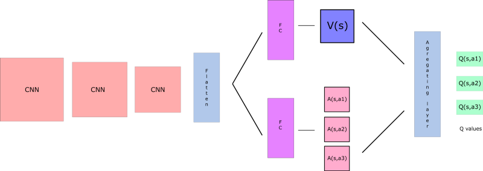

# Deep Q-Network

#### 1. Introduction

Q-learning is a form of Temporal Difference (TD) learning


For the following improvements to Deep Q-Network a more detailed description can be found here:

* https://www.freecodecamp.org/news/improvements-in-deep-q-learning-dueling-double-dqn-prioritized-experience-replay-and-fixed-58b130cc5682/

And for some implementations other than mine:

* https://github.com/higgsfield/RL-Adventure

I would highly recommend to try implement the solution before looking here though.

____

#### 2. Experience Replay

Experience replays helps us address one type of correlation. That is between consecutive experience tupels

When the agent interacts with the environment, the sequence of  experience tuples can be highly correlated (connected to eachother).  The naive Q-learning  algorithm that learns from each of these experience tuples in sequential  order runs the risk of getting swayed by the effects of this  correlation, or in other words priotizing the actions that we have seen the most.

By instead keeping track of a **replay buffer** and using **experience replay** to sample from the buffer at random, we can prevent action values from oscillating or diverging catastrophically.

The **replay buffer** contains a collection of experience tuples (SSS, AAA, RRR, S′S'S′).  The tuples are gradually added to the buffer as we are interacting with the environment.

The act of sampling a small batch of tuples from the replay buffer in order to learn is known as **experience replay**.   In addition to breaking harmful correlations, experience replay allows  us to learn more from individual tuples multiple times, recall rare  occurrences, and in general make better use of our experience.

TLDR; So instead of learning sequentail, we are keeping a buffer of <S,A,R,S'> pairs and learn from these in a random order. We can learn multiple times from each pair, and by doing so we can priotize seeing the rare cases more often than the normal pairs.

____

#### 3. Fixed Q-Targets

There is another kind of correlation that Q-learning is susceptible to.

In Q-Learning, we **update a guess with a guess**, and this can potentially lead to harmful correlations.  To avoid this, we can update the parameters $w$ in the network $\hat{q}$ to better approximate the action value corresponding to state $S$ and action $A$ with the following update rule:


where $w^-$ are the weights of a separate target network that are not changed during the learning step, and $(S, A, R, S')$ is an experience tuple.

The main idea is to use two separate networks with identical architectures. 
Lets call it target Q-Network and primary Q-Network, where the target Q-Network is updated less often to have a stable (fixed) target $\hat{q} (S',a ,w^-)$.

____

#### 4. Double DQN

Deep Q-Learning [tends to overestimate](https://www.ri.cmu.edu/pub_files/pub1/thrun_sebastian_1993_1/thrun_sebastian_1993_1.pdf) action values.  [Double Q-Learning](https://arxiv.org/abs/1509.06461) has been shown to work well in practice to help with this. 

To understand this problem better we look to how we compute the TD-target:


When computing the TD-target, we face the problem of: How are we sure that the best action for the next state is the action with the highest $Q$-value?

We know that the accuracy of $Q$-values depends on what action we tried **and** what neighbouring states we explored.

As a consequence, at the beginning of the training we don’t have enough information about the best action to take. Therefore, taking the maximum q value (which is noisy) as the best action to take can lead to false positives. If non-optimal actions are regularly **given a higher Q value than the optimal best action, the learning will be complicated.**


**The solution is**: 

when we compute the Q target, we use two networks to decouple the action selection from the target Q value generation. We:

- use our DQN network to select what is the best action to take for the next state (the action with the highest Q value).
- use our target network to calculate the target Q value of taking that action at the next state.


Therefore, Double DQN helps us reduce the overestimation of q values and, as a consequence, helps us train faster and have more stable learning.

(NOTE: The implementation shows no sign of improvement "yet")

____

#### 5. Prioritized Experience Replay

Deep Q-Learning samples experience transitions *uniformly* from a replay memory.  [Prioritized experienced replay](https://arxiv.org/abs/1511.05952) is based on the idea that the agent can learn more effectively from some transitions than from others, and the more important transitions should be sampled with higher probability. 

Prioritized Experience Replay (PER) was introduced in 2015 by [Tom Schaul](https://arxiv.org/search?searchtype=author&query=Schaul%2C+T). The idea is that some experiences may be more important than others for our training, but might occur less frequently.

Using Experience Replay we sample the batch uniformly ( selecting the experience randomly), where these rich experiences that occur rarely have practically no chance to be selected.

This is why, with PER, we try to change the sampling distribution by using a criterion to define the priority of each tuple of experience.

We want to take in priority **experience where there is a big difference between our prediction and the TD target, since it means that we have a lot to learn about it.**

We use the absolute value of the magnitude of our TD error to compute the priority of the experience :
$$
p_t = |\delta_t| + e
$$
where $|\delta_t|$ is the magnitude of our TD error also described as $|\delta| = |Q_{\text{target}} -Q_{\text{expected}}|$. **e** is a constant to assure that no experience has 0 probability to be taken.

But we can’t just do greedy prioritization, because it will lead to always training the same experiences (that have big priority), and thus over-fitting.

So we introduce stochastic prioritization, **which generates the probability of being chosen for a replay.**:


As consequence, during each time step, we will get a batch of samples with this probability distribution and train our network on it.

But, we still have a problem here. Remember that with normal Experience Replay, we use a stochastic update rule. As a consequence, the **way we sample the experiences must match the underlying distribution they came from.**

When we do have normal experience, we select our experiences in a normal distribution — simply put, we select our experiences randomly. There is no bias, because each experience has the same chance to be taken, so we can update our weights normally.

**But**, because we use priority sampling, purely random sampling is abandoned. As a consequence, we introduce bias toward high-priority samples (more chances to be selected).

And, if we update our weights normally, we take have a risk of over-fitting. Samples that have high priority are likely to be used for training many times in comparison with low priority experiences (= bias). As a consequence, we’ll update our weights with only a small portion of experiences that we consider to be really interesting.

To correct this bias, we use importance sampling weights (IS) that will adjust the updating by reducing the weights of the often seen samples.


The weights corresponding to high-priority samples have very little adjustment (because the network will see these experiences many times), whereas those corresponding to low-priority samples will have a full update.

The role of **b** is to control how much these importance sampling weights affect learning. In practice, the b parameter is annealed up to 1 over the duration of training, because these weights are more important **in the end of learning when our q values begin to converge.** The unbiased nature of updates is most important near convergence, as explained in this [article](http://pemami4911.github.io/paper-summaries/deep-rl/2016/01/26/prioritizing-experience-replay.html).


#### 5.1 Implementing PER

This time, the implementation will be a little bit fancier.

First of all, we can’t just implement PER by sorting all the Experience Replay Buffers according to their priorities. This will not be efficient at all due to **O(nlogn) for insertion and O(n) for sampling.**

As explained in[ this really good article](https://jaromiru.com/2016/11/07/lets-make-a-dqn-double-learning-and-prioritized-experience-replay/), we need to use another data structure instead of sorting an array — an unsorted **sumtree.**

A sumtree is a Binary Tree, that is a tree with only a maximum of two children for each node. The leaves (deepest nodes) contain the priority values, and a data array that points to leaves contains the experiences.

Updating the tree and sampling will be really efficient $O(log n)$.


Then, we create a memory object that will contain our sumtree and data.

Next, to sample a minibatch of size k, the range [0, total_priority] will be divided into k ranges. A value is uniformly sampled from each range.

Finally, the transitions (experiences) that correspond to each of these sampled values are retrieved from the sumtree.

Implementation other than mine: https://github.com/Ullar-Kask/TD3-PER/tree/master/Pytorch/src

____

#### 6. Duelling DQN (aka. DDQN)

Currently, in order to determine which states are (or are not) valuable, we have to estimate the corresponding action values *for each action*.  However, by replacing the traditional Deep Q-Network (DQN) architecture with a [dueling architecture](https://arxiv.org/abs/1511.06581), we can assess the value of each state, without having to learn the effect of each action.

so remember that Q-values correspond **to how good it is to be at that state and taking an action at that state Q(s,a).**

So we can decompose Q(s,a) as the sum of:

- **V(s)**: the value of being at that state
- **A(s,a)**: the advantage of taking that action at that state (how much better is to take this action versus all other possible actions at that state).

$$
Q(s,a) = V(s) + A(s,a)
$$

With DDQN, we can to separate the estimator of these two elements, using two new streams:

- one that estimates the **state value V(s)**
- one that estimates the **advantage for each action A(s,a)**



And then we combine these two streams **through a special aggregation layer to get an estimate of Q(s,a).**
$$
\text{Aggregation layer:  } Q(s,a) = \text{value} + (\text{advantage} - mean(\text{advantage}))
$$


Wait? **But why do we need to calculate these two elements separately if then we combine them?**

By decoupling the estimation, intuitively our DDQN can learn which states are valuable without learning the effect of each action in that state. Look at it this way, if the value in the state is so bad that it really doesn't matter what action we take it will still be a bad state to be in.

With our normal DQN, we need to calculate the value of each action at that state. **But what’s the point if the value of the state is bad?** What’s the point to calculate all actions at one state when all these actions lead to death?

As a consequence, by decoupling we’re able to calculate V(s). This is particularly **useful for states where their actions do not affect the environment in a relevant way.** In this case, it’s unnecessary to calculate the value of each action. For instance, moving right or left only matters if there is a risk of collision. And, in most states, the choice of action has no effect on what happens.

This architecture helps us accelerate the training. We can calculate the value of a state without calculating the Q(s,a) for each action at that state. And it can help us find much more reliable Q values for each action by decoupling the estimation between two streams.

(NOTE: The implementation shows no sign of improvement "yet")

____

#### 7. Rainbow

So far, you've learned about three extensions to the Deep Q-Networks (DQN) algorithm:

- Double DQN (DDQN)
- Prioritized experience replay 
- Dueling DQN 

But these aren't the only extensions to the DQN algorithm!  Many more extensions have been proposed, including:

- Learning from [multi-step bootstrap targets](https://arxiv.org/abs/1602.01783) (as in A3C - *you'll learn about this in the next part of the nanodegree*)
- [Distributional DQN](https://arxiv.org/abs/1707.06887)
- [Noisy DQN](https://arxiv.org/abs/1706.10295)

Each of the six extensions address a **different** issue with the original DQN algorithm.

Researchers at Google DeepMind recently tested the performance of an  agent that incorporated all six of these modifications.  The  corresponding algorithm was termed [Rainbow](https://arxiv.org/abs/1710.02298).

It outperforms each of the individual modifications and achieves state-of-the-art performance on Atari 2600 games!


____

#### 8. Algorithm Deep Q-network (With Experience replay and fixed Q-target)

**8.1 Agent - Functionality**

How we initialize the agent, this can of cause be done in sooo many ways, but here is an example:

 ~~~~python
def __init__(self, state_size, action_size, seed):
    """Initialize an Agent object.
        
	Params
	======
		state_size (int): dimension of each state
		action_size (int): dimension of each action
		seed (int): random seed
	"""
	self.state_size = state_size
	self.action_size = action_size
	self.seed = random.seed(seed)
		
	# ------------------- Q-Network ------------------- #
	# We need two QNetworks, one for choosing action (local)  
	# and one for displaying a fixed target (target). 
	self.qnetwork_local = QNetwork(state_size, action_size, seed).to(device)
	self.qnetwork_target = QNetwork(state_size, action_size, seed).to(device)
	# Choosing an optimizer for updating the weights.
	self.optimizer = optim.Adam(self.qnetwork_local.parameters(), lr=LR)

	# Replay memory (will be shown in later sections)
	self.memory = ReplayBuffer(action_size, BUFFER_SIZE, BATCH_SIZE, seed)
	# Initialize time step (for updating every UPDATE_EVERY steps)
	self.t_step = 0
 ~~~~

Next we can see how we step and how we choose an action:

~~~~python
def step(self, state, action, reward, next_state, done):
	# Save experience in replay memory
	self.memory.add(state, action, reward, next_state, done)
        
	# Learn every UPDATE_EVERY time steps.
	self.t_step = (self.t_step + 1) % UPDATE_EVERY
	if self.t_step == 0:
		# If enough samples are available in memory, get random subset and learn
		if len(self.memory) > BATCH_SIZE:
			experiences = self.memory.sample()
			self.learn(experiences, GAMMA)

def act(self, state, eps=0.):
	"""Returns actions for given state as per current policy.
        
	Params
	======
		state (array_like): current state
		eps (float): epsilon, for epsilon-greedy action selection
	"""
	state = torch.from_numpy(state).float().unsqueeze(0).to(device)
	self.qnetwork_local.eval()
	with torch.no_grad():
		action_values = self.qnetwork_local(state)
	self.qnetwork_local.train()

	# Epsilon-greedy action selection
	if random.random() > eps:
		return np.argmax(action_values.cpu().data.numpy())
	else:
		return random.choice(np.arange(self.action_size))
~~~~


**8.2 Agent - Update network**

Here we see an example on how we can update the network from a batch of experience.

~~~~python
def learn(batch, GAMMA):
    """
    Update value parameters using given batch of experience tuples.
    Params
    ======
      experiences(batch) (Tuple[torch.Variable]): tuple of (s, a, r, s', done) tuples 
      gamma (float): discount factor
	"""
    # Unpack batch into 5 tensors
	states, actions, rewards, next_states, dones = batch
    
    # ------------------- Compute loss and minimize ------------------- #
    
    # Compute target Q-value, returns a vector of max Q_value for each next_state.
    Qval_next_state = Qn_target(next_states).detach()
    # Find the best Q-value for each next_state returns the max value in a list and the position of the max value
    max_Qval_nState, max_Qval_indice = Qval_next_state.max(1)
    # Unsqueezing the tensor to make a vector and not a list.
    max_Qval_nState = max_Qval_nState.unsqueeze(1)
    
    # Finding the target value for current state
    Q_Target_val = rewards + (GAMMA * max_Qval_nState * (1-dones))
    
    # Find the actual Q-value we got from this state:
    Qvals = Qn_local(states)
    # Find the Q-value for the given action we took:
    Qvals_done = Qvals.gather(1, actions)
    
    # Finding the loss between the what we done and what our target was:
    loss = loss_func(Qvals_done, Qvals_target)
    
    #### Minimize loss (update weights) ####
    # Let the gradient be reset
    self.optimizer.zero_grad()
    # Compute backpropergations:
    loss.backward()
    # Optimize and update:
    self.optimizer.step()
    
    # ------------------- update target network ------------------- #
    self.soft_update(self.qnetwork_local, self.qnetwork_target, TAU)   
~~~~


Soft update means we are learning "tau" from the new network and keep 1-"tau" from the old.

~~~~python
def soft_update(self, local_model, target_model, tau):
    """Soft update model parameters.
        θ_target = τ*θ_local + (1 - τ)*θ_target

        Params
        ======
            local_model (PyTorch model): weights will be copied from
            target_model (PyTorch model): weights will be copied to
            tau (float): interpolation parameter 
   """
	for target_param, local_param in zip(target_model.parameters(), 															local_model.parameters()):
		target_param.data.copy_(tau*local_param.data + (1.0-tau)*target_param.data)
~~~~


**8.3 Experience Replay**

This is an implementation of the Experience Replay, we call it the replay buffer.

~~~~python
class ReplayBuffer:
    """Fixed-size buffer to store experience tuples."""

    def __init__(self, action_size, buffer_size, batch_size, seed):
        """Initialize a ReplayBuffer object.

        Params
        ======
            action_size (int): dimension of each action
            buffer_size (int): maximum size of buffer
            batch_size (int): size of each training batch
            seed (int): random seed
        """
        self.action_size = action_size
        self.memory = deque(maxlen=buffer_size)  
        self.batch_size = batch_size
        self.experience = namedtuple(
            "Experience", 
			field_names=["state", "action", "reward", "next_state", "done"]
        )
        self.seed = random.seed(seed)
    
    def add(self, state, action, reward, next_state, done):
        """Add a new experience to memory."""
        e = self.experience(state, action, reward, next_state, done)
        self.memory.append(e)
    
    def sample(self):
        """Randomly sample a batch of experiences from memory."""
        experiences = random.sample(self.memory, k=self.batch_size)

        states = torch.from_numpy(
            np.vstack([e.state for e in experiences if e is not None])
        ).float().to(device)
        
        actions = torch.from_numpy(
            np.vstack([e.action for e in experiences if e is not None])
        ).long().to(device)
        
        rewards = torch.from_numpy(
            np.vstack([e.reward for e in experiences if e is not None])
        ).float().to(device)
        
        next_states = torch.from_numpy(
            np.vstack([e.next_state for e in experiences if e is not None])
        ).float().to(device)
        
        dones = torch.from_numpy(
            np.vstack(
                [e.done for e in experiences if e is not None]
            ).astype(np.uint8)
        ).float().to(device)
  
        return (states, actions, rewards, next_states, dones)

    def __len__(self):
        """Return the current size of internal memory."""
        return len(self.memory)
~~~~

**8.5 Main function**

```python
def dqn(agent, n_episodes=500, max_t=1000, eps_start=1.0, eps_end=0.01, eps_decay=0.995):
    """Deep Q-Learning.

    Params
    ======
        n_episodes (int): maximum number of training episodes
        max_t (int): maximum number of timesteps per episode
        eps_start (float): starting value of epsilon, for epsilon-greedy action 							   selection
        eps_end (float): minimum value of epsilon
        eps_decay (float): multiplicative factor (per episode) for decreasing epsilon
    """
    scores = []  # list containing scores from each episode
    scores_window = deque(maxlen=100)  # last 100 scores
    eps = eps_start  # initialize epsilon
    for i_episode in range(1, n_episodes + 1):
        state = env.reset()
        score = 0
        for t in range(max_t):
            action = agent.act(state, eps)
            next_state, reward, done, _ = env.step(action)
            agent.step(state, action, reward, next_state, done)
            state = next_state
            score += reward
            if done:
                break
        scores_window.append(score)  # save most recent score
        scores.append(score)  # save most recent score
        eps = max(eps_end, eps_decay * eps)  # decrease epsilon
        print('\rEpisode {}\tAverage Score: {:.2f}'.format(i_episode, np.mean(scores_window)), end="")
        if i_episode % 100 == 0:
            print('\rEpisode {}\tAverage Score: {:.2f}'.format(i_episode, np.mean(scores_window)))
        if np.mean(scores_window) >= 200.0:
            print('\nEnvironment solved in {:d} episodes!\tAverage Score: {:.2f}'.format(i_episode - 100,
                                                                                         np.mean(scores_window)))
            torch.save(agent.qnetwork_local.state_dict(), 'checkpoint.pth')
            break
    return scores
```